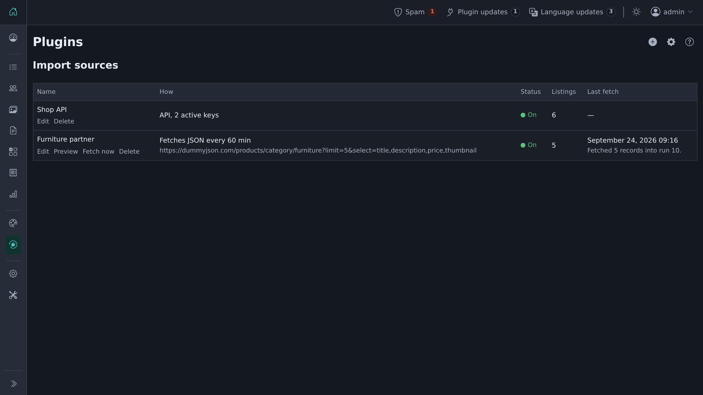
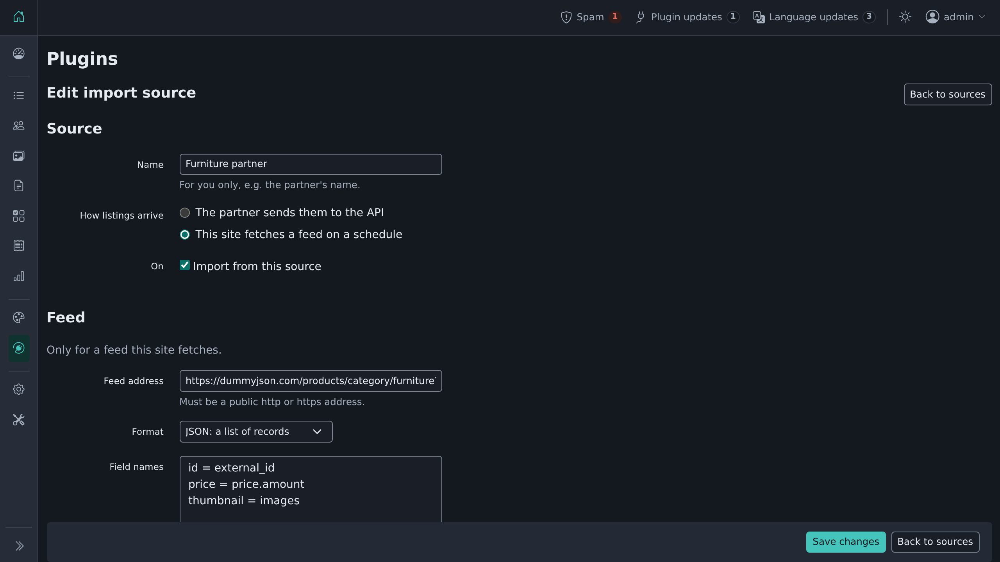
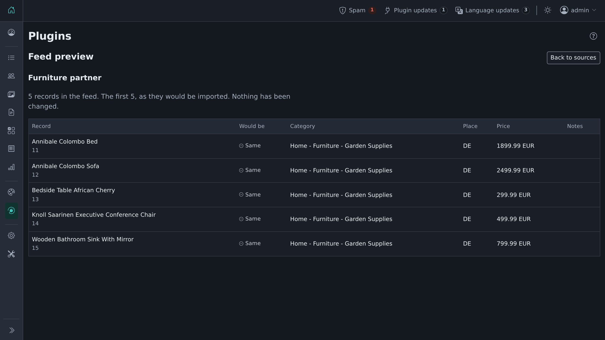
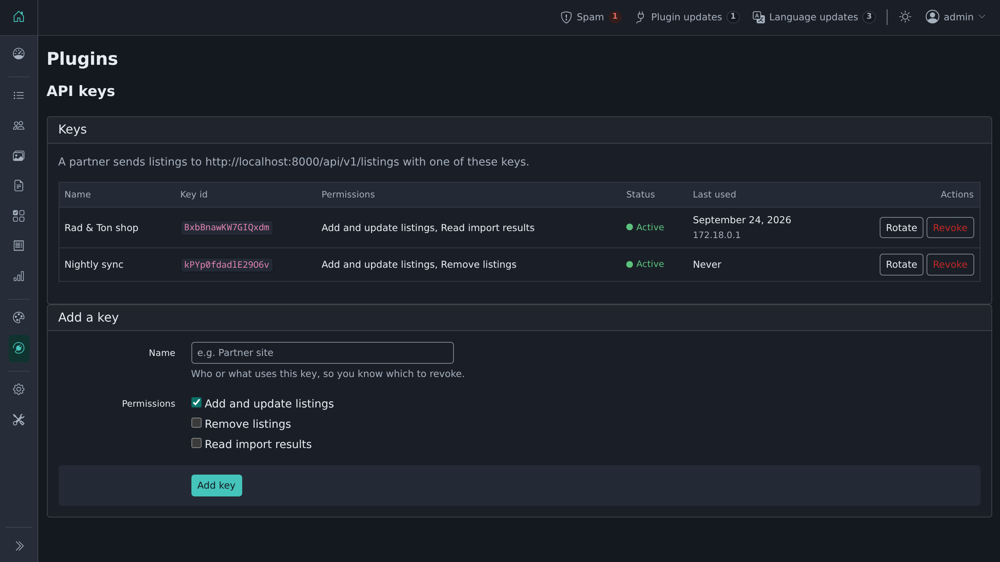
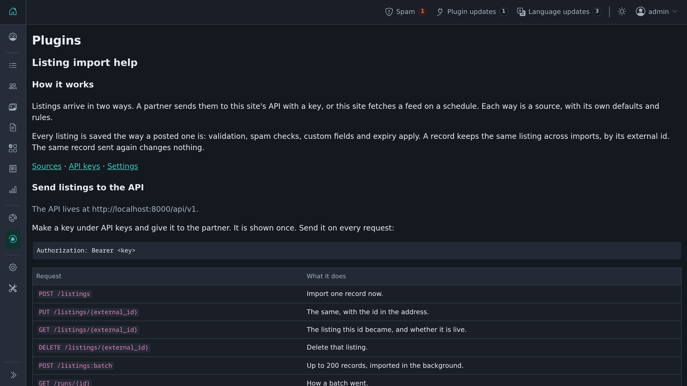

# Listing Import

Import listings into Shopclass from other systems: a keyed REST API, and scheduled JSON,
CSV and RSS feeds. Every listing goes through the same checks as one posted by hand:
moderation, spam checks, listing limits and expiry.



| | |
|---|---|
|  |  |
| A feed source | Preview a feed before it changes anything |
|  |  |
| API keys with their own permissions | A help screen with the API guide |

## Requirements

- Shopclass 6.4.0 or later
- PHP 8.0 or later

## Install

From the admin: **Plugins → Manage plugins → Browse**, find *Listing Import*, then
**Install**. Or from the command line:

```bash
php oc-cli.php market:install listing-import
```

## Check that it works

```bash
curl https://example.com/api/v1/ping
```

With friendly URLs off, use the query form:

```bash
curl "https://example.com/index.php?page=route&route=listing-import-api&path=ping"
```

Both answer:

```json
{"data":{"plugin":"listing-import","version":"0.1.0"}}
```

## Make a key

**Plugins → Listing import → API keys → Add a key.** Pick its permissions:

| Permission | Lets the key |
|---|---|
| `listings:write` | import listings, and read where one stands |
| `listings:delete` | delete a listing it imported |
| `runs:read` | read how a batch went |

The key is shown once. Keep it safe. Send it on every request:

```
Authorization: Bearer <key>
```

Or make one from the command line:

```bash
php oc-cli.php import:key:create --name="Partner site" --scopes=listings:write,runs:read
```

## Send listings

| Request | What it does |
|---|---|
| `POST /api/v1/listings` | Import one record now. |
| `PUT /api/v1/listings/{external_id}` | The same, with the id in the address. |
| `GET /api/v1/listings/{external_id}` | The listing this id became, its address, and if it is live. |
| `DELETE /api/v1/listings/{external_id}` | Delete that listing. |
| `POST /api/v1/listings:batch` | Up to 200 records, imported in the background. |
| `GET /api/v1/runs/{id}` | How a batch went. |
| `GET /api/v1/openapi.json` | The whole API as an OpenAPI 3.1 file. No key needed. |

The smallest record:

```json
{
  "external_id": "A-1001",
  "title": "Blue bike",
  "description": "A good bike, 21 gears.",
  "category": "Vehicles > Bikes"
}
```

The `external_id` is your id. Send the same id again and the plugin updates the listing it made
before. Send the same record again and nothing changes. There is no partial update: always send
the whole record.

An id in an address cannot hold a slash. Encode other characters as usual (`A%201001`).

Other fields, all optional:

- `category`: an id, a slug, a path, or `{"label": "Bikes"}`. A source can set a default.
- `price`: `{"amount": "1.234,50", "currency": "EUR"}`.
- `location`: `country`, `region`, `city`, `city_area`, `address`, `zip`, `lat`, `lng`. Names are
  matched to the site's own places.
- `contact`: `name`, `email`, `phone`, `show_email`.
- `owner`: `{"email": "seller@example.com"}` or `{"user_id": 12}` for an account on the site.
  Used only when the source allows records to choose accounts (off by default); otherwise
  ignored with a warning.
- `images`: one public `http`/`https` address, or a list of up to 20. JPEG, PNG, GIF or WebP, 8 MB each.
  The first 10 are fetched; the rest come back as a warning.
- `fields`: custom field slug → value.
- `title` and `description` may be per language: `{"en_US": "Bike", "de_DE": "Fahrrad"}`.
- `expires_at`, `published_at`: dates. `source_url`: the listing on your side.

A field the plugin does not know comes back as a warning. The record is still imported.

A batch answers at once with a run id:

```bash
curl -X POST https://example.com/api/v1/listings:batch \
  -H "Authorization: Bearer $KEY" -H "Content-Type: application/json" \
  -d '{"records": [ ... ]}'
```

```json
{"data":{"run_id":42,"records":150,"status":"queued"}}
```

The site's background jobs import the records. Check `GET /api/v1/runs/42` for the result.

## Errors and limits

Every error has the same shape:

```json
{"error":{"code":"not_imported","message":"The record was not imported; see fields.","fields":{"title":"Required."}}}
```

| Status | Code | Why |
|---|---|---|
| 400 | `invalid_json` | The body is not JSON. |
| 401 | `unauthorized` | No key, or a wrong one. |
| 403 | `forbidden` | The key lacks the permission. |
| 404 | `not_found` | No such endpoint, listing or run. |
| 405 | `method_not_allowed` | The endpoint does not take that method. |
| 409 | `no_source` | The key's source is missing or switched off. |
| 413 | `too_large`, `too_many_records` | Body over 1 MB, or more than 200 records. |
| 415 | `unsupported_media_type` | Send `Content-Type: application/json`. |
| 422 | `not_imported`, `invalid_batch`, `id_mismatch` | The record is wrong. `fields` says where. |
| 429 | `rate_limited` | Too many requests. Wait for `Retry-After` seconds. |
| 500 | `not_deleted`, `server_error` | Something failed on the site. The site's error log says what. |

Each key may send 60 requests a minute. Change it on the plugin's settings page. An address
that sends a wrong key 20 times in 15 minutes is refused for a while.

The site's own rules apply to every listing: moderation, spam checks, listing limits, expiry.

## Pull a feed

**Plugins → Listing import → Sources**, then the **+** button. Give the feed address, its format, and how
often to fetch it. Formats: JSON, NDJSON, CSV, or another Shopclass site's RSS, up to 5,000
records and 20 MB. A JSON feed
may be a plain list or an object holding one list, such as `{"products": [...]}`.

If the feed names its fields differently, map them one per line:

```
id = external_id
Headline = title
Town = location.city
Cost = price.amount
```

**Preview** shows what a fetch would import, without changing anything. **Fetch now** queues a
fetch at once.

A listing whose record leaves the feed is deactivated, not deleted. It comes back when the
record returns. If most records in a fetch fail, nothing is deactivated.

## Import a file

**Plugins → Listing import → Import a file.** Upload a JSON, NDJSON, CSV or RSS file, up to
20 MB and 5,000 records, and choose its source. The preview shows how each record would be imported. Nothing
changes until you click **Import**. Listings the file leaves out are not touched.

## Command line

```bash
php oc-cli.php import:run --file=records.json --dry-run   # check a file, change nothing
php oc-cli.php import:run --file=records.ndjson           # import it now
php oc-cli.php import:status                              # the latest runs
php oc-cli.php jobs:work                                  # run queued batches and feeds now
```

Batches and feeds run with the site's background jobs. Make sure the site's cron runs.

## Licence

GPL-3.0-or-later. See `LICENSE`.
